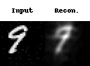
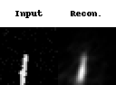
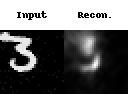
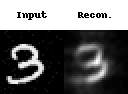
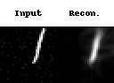
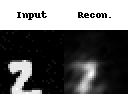
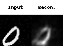
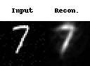

# Predictive learning
Repository to accompany the paper 'Predictive learning with local plasticity in excitatory-inhibitory networks'

### Model Reconstructions Showcase

| Example 1 | Example 2 | Example 3 | Example 4 |
| :---: | :---: | :---: | :---: |
|  |  |  |  |
| **Example 5** | **Example 6** | **Example 7** | **Example 8** |
|  |  |  |  |
