# Predictive learning
Repository to accompany the paper <a href="https://www.biorxiv.org/content/10.64898/2026.08.31.748357v1">Predictive learning with local plasticity in excitatory-inhibitory networks</a>

## Results

### Sequence extrapolation in the Moving MNIST dataset

| Example 1 | Example 2 | Example 3 |
| :---: | :---: | :---: |
| 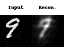 | 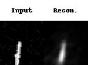 | 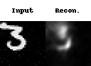 |
| **Example 4** | **Example 5** | **Example 6** |
| 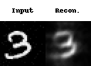 | 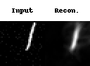 | 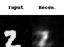 |
| **Example 7** | **Example 8** | **Example 9** |
| 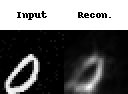 | 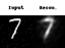 | 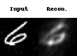 |

### Sequence extrapolation in the Crossbar dataset
| Example 1 | Example 2 | Example 3 |
| :---: | :---: | :---: |
| 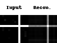 | 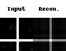 | 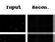 |


## Networks

Firing rate models of biological neural networks with recurrent inhibitory dynamics and local plasticity. Includes multiple network classes, multiple toy video generators and a general simulator.

The networks are instantiated using a hyperparameter dictionary. The main network class, `LateralInhibitoryLayer`, relies on lateral inhibition to learn factorized representations of inputs via local plasticity rules.

### Creating a Network
To create a network, configure its parameters using the default hyperparameter template and instantiate the class:

```python
from networks import LateralInhibitoryLayer

# Get default hyperparameters for a given input shape (e.g., 12x12 image)
hparams = LateralInhibitoryLayer.default_hparams((12, 12, 1))

# Customize hyperparameters
hparams['num_units_y'] = 36       # Number of neurons in the layer
hparams['activation'] = 'relu'    # Activation function
hparams['gradient'] = 'voltage'   # Gradient calculation method
hparams['w_update'] = 'bcm_abs'   # Weight update rule
hparams['w_lr'] = 0.01            # Feedforward learning rate

# Instantiate the network
net = LateralInhibitoryLayer(hparams)
```

### Network Configuration Options

**Activation Functions** (`hparams['activation']`):
* `'relu'`: standard Rectified Linear Unit.
* `'sigmoid'`: standard logistic sigmoid.
* `'tanh'`: hyperbolic tangent.
* `'exp'`: exponential activation.
* `'linear'`: pass-through (linear) activation.

**Gradients** (`hparams['gradient']`):
* `'voltage'`: Updates based on voltage integration. 
* `'rate'`: Updates based solely on rate changes.

**Updates (`w_update`, `p_update`, `m_update`)**:
The network processes synaptic updates over three main connectivity matrices. Here are all supported plasticity rules for each matrix:

* **W (Feedforward)**: Connects inputs (x) to the layer (y). 
  * Available rules: `'hebbian'`, `'foldiak'`, `'oja'`, `'pehlevan'`, `'chklovskii'`, `'reconstruction'`, `'perceptron'`, `'bcm_abs'`, `'bcm_linear'`, `'bcm_sqr'`, `'bcm_thrs'`.
* **P (Temporal/Prediction)**: Connects previous states (y at t-1) to current states (y at t). 
  * Available rules: `'hebbian'`, `'chklovskii'`, `'foldiak'`, `'oja'`, `'pehlevan'`, `'reconstruction'`, `'perceptron'`, `'bcm_abs'`, `'bcm_linear'`, `'bcm_sqr'`, `'bcm_thrs'`, `'stdp'`.
* **M (Lateral/Recurrent)**: Internal recurrent connections between units (y to y) for lateral inhibition. 
  * Available rules: `'hebbian'`, `'chklovskii'`, `'foldiak'`, `'foldiak-constant'`, `'oja'`, `'pehlevan'`, `'perceptron'`, `'bcm_abs'`.

---

## Video Generators

Generators provide spatial and spatiotemporal sequences to test the networks. They rely on simplified structural environments to mimic moving obstacles, gratings, or random dots. All generators are instantiated using a hyperparameter dictionary.

### Creating a Generator
Each generator has a `default_params()` static method that returns a dictionary with its default configuration. You can modify these parameters and pass them to the generator's initialization method.

```python
from generators import MultipleSpeedCrossingBar

# Get default parameters
gen_params = MultipleSpeedCrossingBar.default_params()

# Modify parameters
gen_params['screen_size'] = 12
gen_params['bar_size'] = 1
gen_params['speed'] = 1
gen_params['noise'] = 0.05

# Instantiate the generator
gen = MultipleSpeedCrossingBar(gen_params)

# Fetching samples during a training loop
for step in range(100):
    # For i.i.d. samples:
    gen.set_random_position()
    
    # Or, to simulate continuous temporal motion:
    # gen.set_next_position() 

    # Retrieve the state
    frame = gen.get_current_frame()
```

### Available Generators and Parameters

**`MultipleSpeedCrossingBar`** (Crossbars)
* `screen_size`: Size of the square screen constraint (e.g., 12).
* `bar_size`: Width/thickness of the crossing bars.
* `speed`: Maximum movement speed of the bars.
* `noise`: Probability of drawing random noise values (noise frequency).

**`MovingDots`**
* `screen_size`: Size of the square screen.
* `num_objects`: Total number of moving dots.
* `speed`: Maximum speed of the moving dots.
* `noise`: Frequency footprint of added background noise.

**`DriftingGratings`**
* `screen_size`: Environment resolution (default: 32).
* `spatial_period`: Distance between grating wave peaks (e.g., 8.0).
* `max_phase_speed`: Maximum phase shift speed per timestep.
* `num_directions`: Number of possible quantized drift directions (e.g., 8).
* `contrast`: Contrast level of the grating from 0.0 to 1.0.
* `mean_luminance`: Mean frame brightness intensity from 0.0 to 1.0.
* `square_wave`: Boolean toggle to use hard square waves instead of soft sinusoidal waves.
* `noise_freq`: Added background noise likelihood.

**`DotMotion`**
* `screen_size`: Size of the square screen.
* `n_dots`: Total number of present dots.
* `dot_radius`: Radii per dot.
* `max_dot_speed`: Maximum dot translation speed per step.
* `num_directions`: Number of possible directions for unified motion coherence (e.g., 16).
* `coherence`: Fraction of dots deliberately moving in the global specified path (0.0 to 1.0).
* `noise_freq`: Ambient background noise.

**`DriftingSingleBar`**
* `screen_size`: Environment resolution (default: 32).
* `bar_width`: Thickness of the drifting bar (default: 5.0).
* `bar_length`: Length of the bar (`None` for an infinite wrap-around bar).
* `max_phase_speed`: Maximum translation speed of the bar.
* `num_directions`: Number of possible quantized drift directions (e.g., 16).
* `contrast`: Contrast level of the bar, from 0.0 to 1.0.
* `mean_luminance`: Mean background luminance from 0.0 to 1.0.
* `soft_edges`: Boolean toggle for anti-aliased/soft edges on the bar.
* `noise_freq`: Ambient background noise frequency.
* `wrap_gap`: Distance gap before wrapping around the screen (default: 32).


